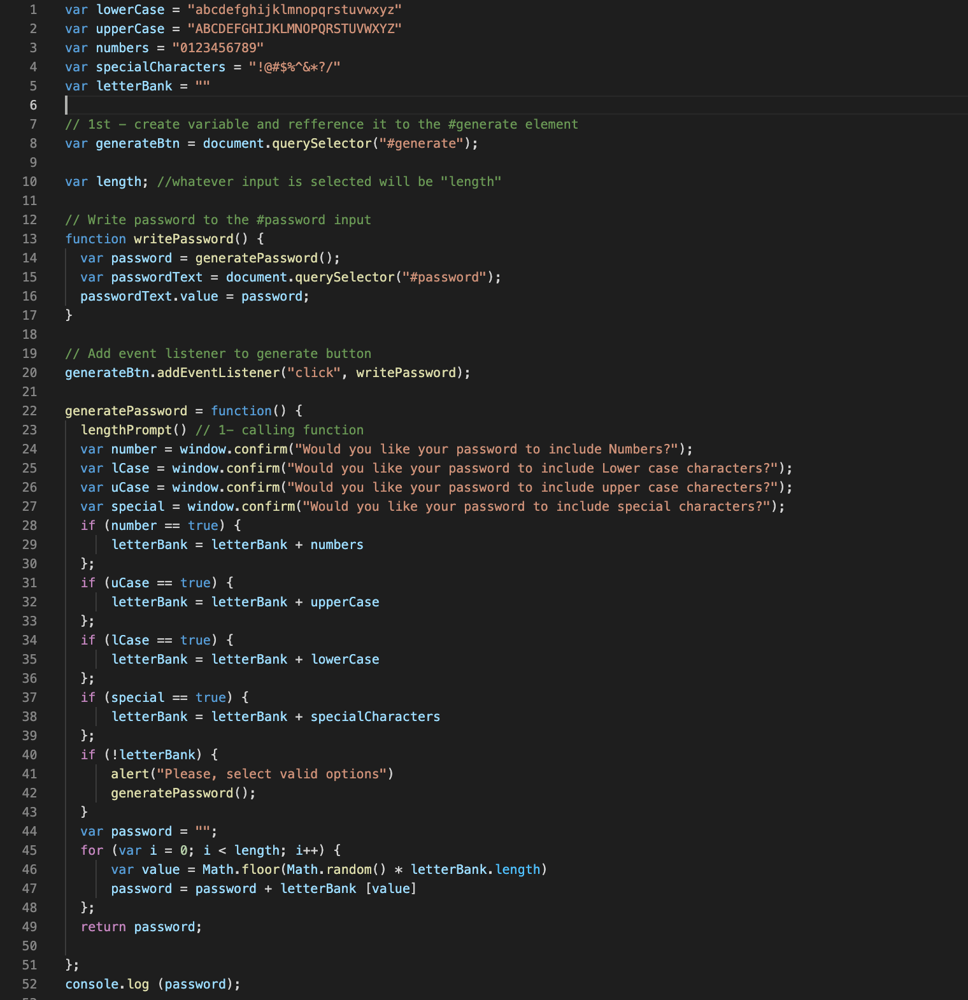
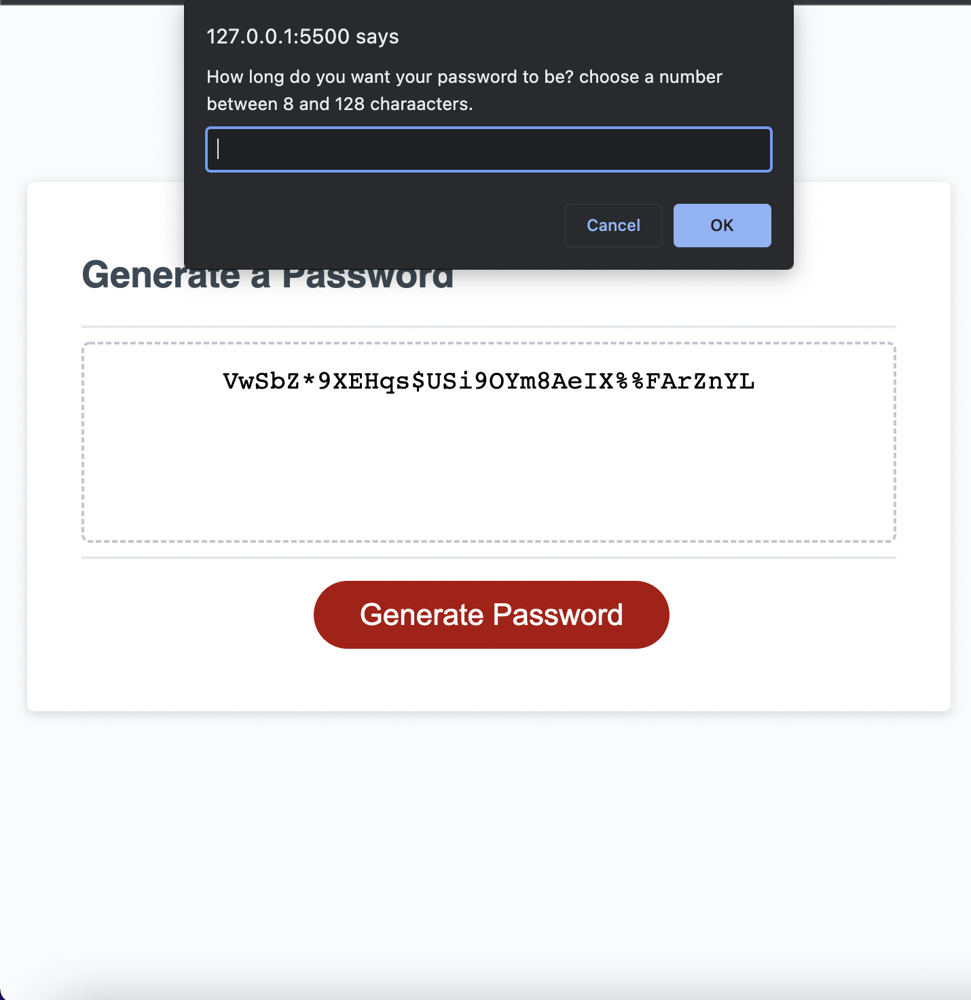

# password_generator

## Description

Welcome to the Password Generator application, the place where you can generate new set of secure passwords for the most various purposes.

The program is set to create random and strong passwords, while providing the user with the option to choose: 
* The length of the password ranging from 8 to 128 characters.
* The characters types such as letters, numbers, special character and upper or lower case.

## Instructions

* First, select the number of characters you wish your password to contain, in a quantity ranging between 8 and 128 characters.
* Second, select the types of characters you wish to include in the password; being these types numbers, letters, special characters, upper case or lower case letters. The options will pop up as prompts so you may make your selections in sequence.

 {
     DIDN'T UNDERSTAND THIS CRITERIA
THEN my input should be validated and at least one character type should be selected
 };

 * When all prompts are answered a password matching the selected criteria will be displayed as an alert and/or written on the page.

 ## Contributers to the project:
 - Paulo Oliverira

## Links and preview: 
![Finished and deployed website project] (https://paulooliveira152012.github.io/password_generator/)

![GitHub-repository] (https://github.com/paulooliveira152012/password_generator)

HTML Screen-shot
 

JavaScript Screen-shot

Website Screen-shot

